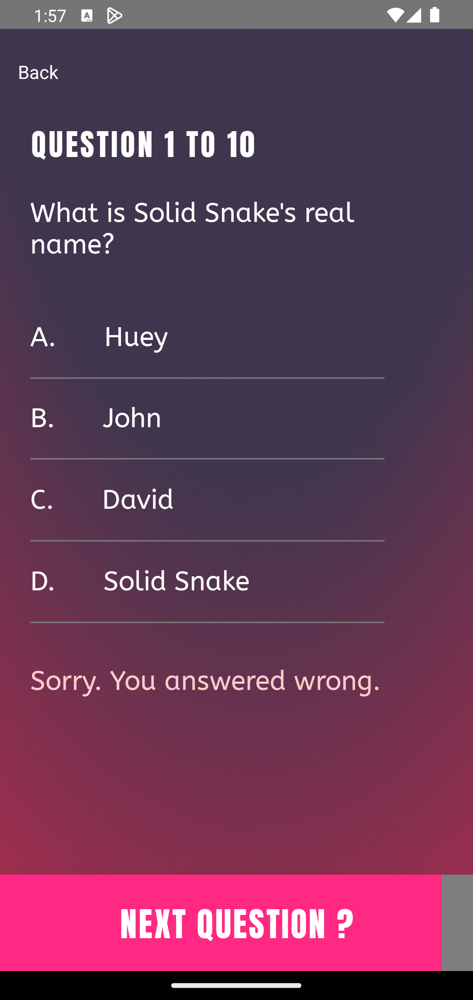

# Proje Adı

Einsteen

# Açıklama

Bu uygulama, Trivia uygulaması tarzında olan süre bazlı soru-cevap mobil uygulamasıdır. Uygulamada veritabanı, file storage, authentication gibi işlemler Google Firebase aracılığıyla sağlanmaktadır. Uygulamanın tasarımı, bu [figma](https://www.figma.com/community/file/1144928934197489720) linkinde yapılan tasarıma sadık kalınarak yapılmıştır.

Kullanıcılar, uygulamaya gerek mail adresi ve şifreleriyle gerekse Google hesaplarıyla giriş yapabilirler. Mail adresi ve şifresi ile giriş yapacak kullanıcılar, önceden üye olmaları gerekir. Üye olma sırasında formik ve yup aracılığıyla kullanıcının girdiği bilgiler doğrulanarak kullanıcı, sisteme kaydedilir. Kullanıcının isim ve soyismi hariç bilgileri Firebase de yer alan authentication kısmında kaydedilirken diğer ek bilgiler ise Firestore Database içerisinde tutulur. Google ile ilk defa giriş yapacak olan kullanıcılar eğer ilk defa bağlanacaksa onların da ek bilgileri Firestore da kaydedilir.

Kullanıcı başarılı bir şekilde giriş yaptıktan sonra ana ekrana yönlendirilirler. Ana ekranda kullanıcı profili ve tekrardan anasayfaya yönlendirileceği buton grupları, yarışmaya başlamadan önce isteğe bağlı olarak zorluk seviyesi ve varsayılan olarak on olmak üzere 10-20-30-40-50 olmak üzere seçenecekler mevcuttur. Bu seçenekler sonrasında kullanıcı, ekran üzerinde yer alan kategorilerden birini seçerek yarışma öncesi bilgilendirme sayfasına yönlendirilir.

Bu sayfada yarışma hakkında (zorluk , soru sayısı ve her soru başına verilen sabit süre) bilgilendirme yapılır. Kullanıcının seçmiş olduğu segmente göre skor ekranını incelemesi veya yarışmaya başlaması için buton grupları mevcuttur.

Yarışmaya başladıktan sonra ekranın alt kısmında geri sayım mevcuttur. Kullanıcı, verilen süre içerisinde herhangi bir şıkkı işaretlemediği taktirde süresi biter ve sonuç ekranına yönlendirilir. Süresini yetiştiremeyen kullanıcıların skoru kaydedilmez. Kullanıcı doğru veya yanlış şıkkı işaretlediği taktirde cevabın doğru veya yanlış olduğu bilgilendirilir. Aşağıdaki geri sayıma basarak bir sonraki soruya geçebilir. Kullanıcı, ekranda yer alan geri butonuna veya cihazındaki geri tuşuna bastığı taktirde yarışmadan çıkış yapacağına emin olması için mesaj gönderilir. Bütün soruları her soru başına atanan süre içerisinde işaretlediği taktirde son sorudan sonra sonuç ekranına yönlendirilir.

Bu sonuç ekranında kendi segmentine göre (zorluk, soru sayısı) doğru yaptığı soru sayısı ve sorulara harcadığı toplam süre kaydedilir. Kullanıcı bu sayfada gerek aynı segmentte tekrar oynayabilir ya da skor ekranına gidebilir.

Anasayfada veya kullanıcı profili ekranında olduğu taktirde eğer cihazındaki geri tuşuna basarsa çıkış yapacağına emin olması için mesaj gönderilir.

Kullanıcı profilinde eğer kullanıcı mail adresi ve şifre ile giriş yapmışsa şu gibi özellikleri güncelleyebilir:

- Şifresini, mevcut şifresini bildiği taktirde değiştirebilir
- Profil fotoğrafını güncelleyebilir, mevcut olan profil fotoğrafını silebilir.

Ayrıca kullanıcı, kendi yapmış olduğu yüksek skorları da inceleyebilir.

<a href="https://github.com/sahinmaral/Einsteen-ReactNative/blob/main/app-release.apk" title="Uygulama APK dosyası">Link</a> üzerinden uygulamayı APK olarak indirip inceleyebilirsiniz.

# Kullanılan paketler ve versiyonları

    "@react-native-community/netinfo": "^11.2.1",
    "@react-native-firebase/app": "^18.7.3",
    "@react-native-firebase/auth": "^18.7.3",
    "@react-native-firebase/firestore": "^18.7.3",
    "@react-native-firebase/storage": "^18.7.3",
    "@react-native-google-signin/google-signin": "^11.0.0",
    "@react-navigation/bottom-tabs": "^6.5.11",
    "@react-navigation/native": "^6.1.9",
    "@react-navigation/stack": "^6.3.20",
    "@reduxjs/toolkit": "^2.0.1",
    "axios": "^1.6.2",
    "formik": "^2.4.5",
    "he": "^1.2.0",
    "lottie-ios": "^3.4.1",
    "lottie-react-native": "^6.4.1",
    "react": "18.2.0",
    "react-native": "^0.73.0",
    "react-native-fast-image": "^8.6.3",
    "react-native-gesture-handler": "^2.14.0",
    "react-native-image-picker": "^7.1.0",
    "react-native-safe-area-context": "^4.7.4",
    "react-native-screens": "^3.29.0",
    "react-native-splash-screen": "^3.3.0",
    "react-native-toast-notifications": "^3.4.0",
    "react-native-uuid": "^2.0.1",
    "react-native-vector-icons": "^10.0.2",
    "react-redux": "^9.0.2",
    "yup": "^1.3.2"

# Uygulamanın çalıştırılması ve test edilmesi hakkında döküman

[Uygulamanın çalıştırılması ve test edilmesi hakkında README](./README_APP.md)

# Ekran Görüntüleri

## Uygulamaya girmeden önceki yükleme ekranı

## Başlangıç Ekranı

## Giriş Ekranı

## Kayıt Olma Ekranı

## Giriş Yaptıktan Sonra Ana Uygulama Ekranı

## Yarışma Zorluk ve Soru Adeti Modal

## Kategori Seçildikten Sonra Yarışmaya Başlamadan Önce Bilgilendirme Ekranı

## Yarışma Ekranı

## Yarışmadan Ayrılmaya Çalışırken Modal

## Yarışma Sonuçları Ekranı

## Scoreboard Ekranı

## Kullanıcıların kendi skorlarını kontrol edebileceği scoreboard ekranı

## Uygulamadan Çıkış Yaptıktan Sonra Modal

## Kullanıcı Hakkında Ekran

## Kullanıcı Şifre Değiştirme Ekranı

## Kullanıcı Profil Fotoğrafı Değiştirme Ekranı

